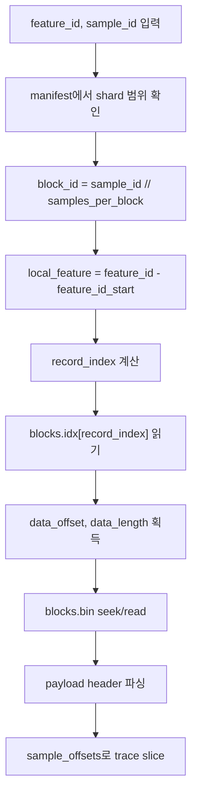
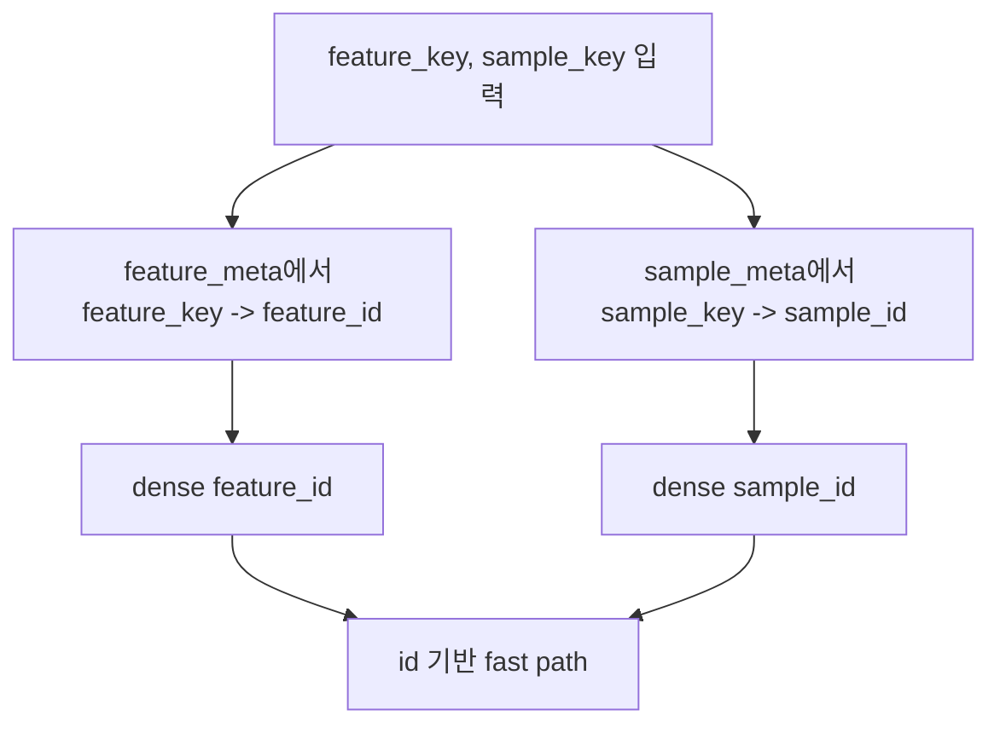

# Array Binary Shard Format v2

이 문서는 array trace serving 전용 custom binary shard 포맷의 **v2 스펙**을 설명한다.

v2의 핵심은 두 가지다.

- 내부 조회용 id는 **dense integer id**로 고정한다.
  - `sample_id == sample_meta.parquet`의 row index
  - `feature_id == feature_meta.parquet`의 row index
- 외부 시스템과 연동할 때는 별도의 stable key를 쓴다.
  - `sample_key`
  - `feature_key`

즉 내부는 빠르고 단순하게, 외부는 사람이 쓰기 쉽게 나눈 구조다.

---

## 1. 전체 구조

binary shard dataset 한 세트는 보통 아래처럼 **한 폴더 단위 artifact**로 움직인다.

```text
array_binary_dataset/
  array_binary_shard_manifest.json
  sample_meta.parquet
  feature_meta.parquet
  array_binary_feature_shards/
    shard_0000.blocks.idx
    shard_0000.blocks.bin
    shard_0001.blocks.idx
    shard_0001.blocks.bin
    ...
```

파일별 역할은 다음과 같다.

- `array_binary_shard_manifest.json`
  - 전체 dataset 메타데이터
  - shard 개수, block 크기, 경로, dtype 정보
- `sample_meta.parquet`
  - sample row order를 정의하는 메타데이터
  - row index가 곧 `sample_id`
- `feature_meta.parquet`
  - feature row order를 정의하는 메타데이터
  - row index가 곧 `feature_id`
- `shard_XXXX.blocks.idx`
  - `(feature_id, block_id)` 슬롯별 offset table
  - 실제 payload가 `blocks.bin`의 어디 있는지 알려준다
- `shard_XXXX.blocks.bin`
  - 실제 trace payload 저장소

중요한 점:

- manifest 안의 경로는 **manifest 기준 relative path**로 저장된다.
- 따라서 이 폴더를 통째로 복사하거나 이동해도 그대로 읽을 수 있어야 한다.

---

## 2. 내부 id와 외부 key

### 내부 id

v2는 dense id를 전제로 한다.

- `sample_id = 0..n_samples-1`
- `feature_id = 0..n_features-1`

이 값은 별도 매핑 없이 바로 serving lookup에 사용된다.

### 외부 key

외부 시스템과 연결할 때는 dense id 대신 key를 쓰는 편이 안전하다.

예:

- `sample_key = "patient_1234_visit_05"`
- `feature_key = "lab/creatinine"`

reader나 API는 보통 다음 두 경로를 모두 지원한다.

- id 기반
  - `feature_id`, `sample_id`
- key 기반
  - `feature_key`, `sample_key`

key 기반 요청은 먼저 metadata에서 key를 dense id로 바꾼 뒤, 내부적으로는 같은 fast path를 탄다.

---

## 3. block이 무엇인가

block은 **같은 feature에 속한 sample 여러 개의 trace를 묶은 단위**다.

예를 들어:

- `n_samples = 5000`
- `samples_per_block = 16`

이면 feature 하나는:

- `blocks_per_feature = ceil(5000 / 16) = 313`

개의 block을 가진다.

feature `123`에 대해:

- block `0`은 sample `0..15`
- block `1`은 sample `16..31`
- block `2`는 sample `32..47`

이런 식이다.

block 하나 안에는 다음이 들어간다.

- 각 sample의 상태 비트 (`sample_flags`)
- 각 sample trace의 경계 (`sample_offsets`)
- 실제 `time` payload
- 실제 `value` payload

---

## 4. 왜 v2가 단순한가

예전 구조에서는 보통 이런 단계가 필요했다.

- `sample_id -> sample_row`
- `feature_id -> feature_row`
- feature index binary search
- block 위치 탐색

v2에서는 dense id를 가정하므로 lookup이 거의 계산식으로 끝난다.

```text
block_id = sample_id // samples_per_block
local_feature = feature_id - shard.feature_id_start
record_index = local_feature * blocks_per_feature + block_id
```

즉:

- shard만 찾으면
- `blocks.idx`에서 몇 번째 레코드를 읽어야 하는지가 계산으로 나온다

이게 v2의 핵심 단순화다.

### 4.1 `local_feature`가 무엇인가

`local_feature`는 **shard 안에서의 feature 번호**다.

전역 `feature_id`는 dataset 전체 기준 번호이고, `local_feature`는 그 중에서 현재 shard 안에서 몇 번째 feature인지를 뜻한다.

예:

- 현재 shard의 feature range가 `128..255`
- 조회하려는 `feature_id = 140`

이면:

```text
local_feature = 140 - 128 = 12
```

즉 이 shard 안에서는 `140`번 feature가 **13번째 feature**라는 뜻이다.

왜 이 값이 필요하냐면, `blocks.idx`는 shard 안에서 feature를 `0, 1, 2, ...` 순서로 배치하기 때문이다.

### 4.2 `record_index`가 무엇인가

`record_index`는 **현재 shard의 `blocks.idx`에서 몇 번째 레코드를 읽어야 하는지**를 뜻한다.

`blocks.idx`는 개념적으로 다음과 같은 2차원 dense grid를 1차원으로 평평하게 편 파일이다.

- 행(row): `local_feature`
- 열(column): `block_id`

즉 각 레코드는:

```text
(local_feature, block_id)
```

한 쌍에 대응한다.

그래서:

```text
record_index = local_feature * blocks_per_feature + block_id
```

가 된다.

예:

- `blocks_per_feature = 313`
- `local_feature = 12`
- `block_id = 7`

이면:

```text
record_index = 12 * 313 + 7 = 3763
```

즉 `blocks.idx`의 **3763번째 레코드**가 필요한 payload 위치를 가리킨다.

### 4.3 그림으로 보면

```text
blocks.idx

feature 0:  block 0, block 1, block 2, ..., block 312
feature 1:  block 0, block 1, block 2, ..., block 312
feature 2:  block 0, block 1, block 2, ..., block 312
...

record_index는 이 2차원 표를 1차원 배열로 폈을 때의 위치다.
```

---

## 5. 실제 조회 흐름

### 5.1 `feature_id + sample_id`



단계별로 쓰면:

1. `feature_id`가 어느 shard에 속하는지 manifest에서 찾는다.
2. `sample_id`로 `block_id`를 계산한다.
3. shard 안에서 `local_feature`를 계산한다.
4. `record_index`를 계산한다.
5. `blocks.idx`의 그 레코드를 읽는다.
6. `data_offset`, `data_length`를 얻는다.
7. `blocks.bin`에서 해당 payload를 읽는다.
8. block 안에서 `relative_sample = sample_id % samples_per_block`로 원하는 trace를 slice한다.

### 5.2 `feature_key + sample_key`

key 기반 요청은 먼저 dense id로 바꾼다.



즉 key 기반 조회도 결국 id 기반 조회 위에 올라간 얇은 변환 계층이다.

---

## 6. end-to-end 예제

아래는 사용자가 실제로 가장 헷갈리기 쉬운 부분인:

- `feature_id`
- `sample_id`
- shard 선택
- `record_index`
- `blocks.idx`
- `blocks.bin`
- 최종 trace slice

를 숫자로 끝까지 따라가는 예제다.

### 6.1 가정

dataset 설정이 다음과 같다고 하자.

- `n_samples = 1000`
- `n_features = 512`
- `samples_per_block = 16`
- `blocks_per_feature = ceil(1000 / 16) = 63`

그리고 shard `3`의 manifest entry가:

- `feature_id_start = 128`
- `feature_id_end = 255`
- `feature_count = 128`

라고 하자.

즉 shard `3`은 feature `128..255`를 담당한다.

### 6.2 요청

사용자가 다음을 조회한다고 하자.

- `feature_id = 140`
- `sample_id = 118`

### 6.3 shard 선택

먼저 `feature_id = 140`이 어느 shard에 속하는지 본다.

- shard `3`의 range가 `128..255`
- `140`은 이 범위 안

따라서 읽어야 할 파일은:

- `shard_0003.blocks.idx`
- `shard_0003.blocks.bin`

이다.

### 6.4 `block_id` 계산

`samples_per_block = 16`이므로:

```text
block_id = sample_id // samples_per_block
         = 118 // 16
         = 7
```

즉 `sample_id = 118`은 feature `140`의 **7번 block** 안에 있다.

실제로 block `7`이 담당하는 sample 구간은:

```text
sample 112..127
```

이다.

### 6.5 `local_feature` 계산

현재 shard 안에서 `feature_id = 140`이 몇 번째 feature인지 계산한다.

```text
local_feature = feature_id - feature_id_start
              = 140 - 128
              = 12
```

즉 shard `3` 안에서는 `feature_id = 140`이 **13번째 feature**다.

### 6.6 `record_index` 계산

이 shard 안에서 feature 하나당 block이 `63`개 있으므로:

```text
record_index = local_feature * blocks_per_feature + block_id
             = 12 * 63 + 7
             = 763
```

즉 이 조회에 필요한 offset 정보는:

```text
blocks.idx[763]
```

에 들어 있다.

### 6.7 `blocks.idx[763]` 읽기

예를 들어 `blocks.idx[763]`가 다음 값이라고 하자.

```text
data_offset   = 1,048,576
data_length   = 904
point_count   = 43
codec         = 0   (none)
block_flags   = 0
reserved0     = 0
crc32_optional = 0
```

이 뜻은:

- 실제 payload는 `blocks.bin`의 `1,048,576` byte 위치에서 시작하고
- 길이는 `904` bytes이고
- 이 block 전체 trace point 수는 `43`

이라는 뜻이다.

### 6.8 `blocks.bin` payload 읽기

이제 reader는:

```text
blocks.bin[data_offset : data_offset + data_length]
```

를 읽는다.

즉:

```text
blocks.bin[1,048,576 : 1,049,480]
```

를 읽는다.

이 바이트 덩어리의 맨 앞 48 bytes는 payload header다.

예를 들어 payload header가:

```text
feature_id       = 140
block_id         = 7
sample_row_start = 112
sample_count     = 16
codec            = 0
point_count      = 43
flags_bytes      = 16
offsets_bytes    = 136
time_bytes       = 344
value_bytes      = 344
```

라고 하자.

여기서 검산할 수 있다.

- `sample_row_start == block_id * samples_per_block`
- `112 == 7 * 16`

로 맞는다.

또 전체 길이도:

```text
48 + 16 + 136 + 344 + 344 = 888
```

여기에 alignment나 추가 바이트가 없는 현재 구현 기준으로는 payload 길이와 일치해야 한다.

### 6.9 block 안에서 원하는 sample 찾기

지금 이 block은 sample `112..127`을 담당한다.

우리가 원하는 sample은 `118`이므로:

```text
relative_sample = sample_id % samples_per_block
                = 118 % 16
                = 6
```

즉 이 block 안에서 **7번째 sample**을 꺼내야 한다.

### 6.10 `sample_offsets`로 trace 구간 자르기

예를 들어 이 block의 `sample_offsets`가:

```text
[0, 0, 5, 8, 8, 14, 20, 27, 31, 31, 34, 37, 39, 39, 41, 43, 43]
```

라고 하자.

`relative_sample = 6`이므로:

```text
start = sample_offsets[6] = 20
end   = sample_offsets[7] = 27
```

즉 원하는 trace는:

- `time_blob[20:27]`
- `value_blob[20:27]`

이다.

길이는:

```text
27 - 20 = 7
```

이므로 sample `118`의 trace 길이는 7이다.

### 6.11 최종 결과

reader는 최종적으로:

- `sample_flags[6]`
- `time_blob[20:27]`
- `value_blob[20:27]`

를 이용해 sample `118`의 trace를 반환한다.

즉 전체 흐름을 한 줄로 줄이면:

```text
feature_id, sample_id
-> shard 선택
-> block_id 계산
-> local_feature 계산
-> record_index 계산
-> blocks.idx[record_index]
-> blocks.bin payload 읽기
-> relative_sample 계산
-> sample_offsets로 trace slice
```

### 6.12 key 기반으로 보면

이번에는 사용자가 id가 아니라:

- `feature_key = "feature_000140"`
- `sample_key = "sample_000118"`

를 줬다고 하자.

그러면 먼저 metadata에서:

- `feature_key -> feature_id = 140`
- `sample_key -> sample_id = 118`

로 바꾼다.

그 다음부터는 **위와 완전히 동일한 경로**를 탄다.

즉 key 기반 요청은 id 기반 경로 앞에:

```text
key -> dense id
```

한 단계만 추가된 구조다.

### 6.13 마지막 block 예외도 이해해야 한다

마지막 block은 항상 `samples_per_block`개를 꽉 채우지 않을 수 있다.

예:

- `n_samples = 1000`
- `samples_per_block = 16`
- 마지막 block id = `62`

그러면 마지막 block은 sample `992..999`를 담당한다.

즉 sample 수는 `16`이 아니라 `8`이다.

따라서 마지막 block payload header에서는:

- `sample_count = 8`
- `flags_bytes = 8`
- `offsets_bytes = 9 * 8 = 72`

처럼 줄어든다.

reader는 block마다 header의 `sample_count`를 믿고 읽어야 한다.

---

## 7. manifest 파일

`array_binary_shard_manifest.json`은 **텍스트 JSON 파일**이다.

- custom binary header를 갖지 않는다
- 사람이 읽을 수 있는 메타데이터 파일이다

예시:

```json
{
  "format": "array-binary-shard",
  "version": 2,
  "endianness": "little",
  "id_scheme": "dense_row_ids",
  "sample_meta_path": "sample_meta.parquet",
  "feature_meta_path": "feature_meta.parquet",
  "n_samples": 5000,
  "n_features": 1000,
  "shard_path": "array_binary_feature_shards",
  "n_shards": 32,
  "samples_per_block": 16,
  "blocks_per_feature": 313,
  "feature_id_dtype": "INT32",
  "flags_dtype": "UINT8",
  "offset_dtype": "INT64",
  "time_dtype": "FLOAT64_LE",
  "value_dtype": "FLOAT64_LE",
  "default_codec": "none",
  "sample_key_col": "sample_key",
  "feature_key_col": "feature_key",
  "shards": [
    {
      "shard_id": 0,
      "feature_id_start": 0,
      "feature_id_end": 127,
      "feature_count": 128,
      "block_count": 40064,
      "blocks_index_name": "shard_0000.blocks.idx",
      "blocks_data_name": "shard_0000.blocks.bin"
    }
  ]
}
```

특히 중요한 필드:

- `sample_meta_path`, `feature_meta_path`
  - metadata 위치
- `samples_per_block`
  - 한 block에 몇 sample을 넣는지
- `blocks_per_feature`
  - dense grid 계산에 필요
- `feature_id_start`, `feature_id_end`, `feature_count`
  - shard 안 feature range를 정의
- `blocks_index_name`, `blocks_data_name`
  - shard별 실제 binary 파일명

---

## 7. metadata 파일

### 7.1 `sample_meta.parquet`

최소 권장 컬럼:

- `sample_id`
- `sample_key`

규칙:

- row 0이면 `sample_id == 0`
- row 1이면 `sample_id == 1`
- ...

즉 row order 자체가 `sample_id`를 정의한다.

key 기반 API를 지원하려면 다음 제약을 두는 것이 좋다.

- `sample_key`는 null이면 안 된다
- `sample_key`는 dataset 전체에서 unique해야 한다
- reader는 중복 key를 허용하지 말고 오류로 처리하는 편이 안전하다

### 7.2 `feature_meta.parquet`

최소 권장 컬럼:

- `feature_id`
- `feature_key`

규칙은 동일하다.

- row 0이면 `feature_id == 0`
- row 1이면 `feature_id == 1`
- ...

주의:

- metadata를 다시 정렬하면 내부 id가 바뀐다.
- 따라서 shard를 다시 만들지 않고 metadata만 재정렬하면 안 된다.

`feature_key`도 같은 제약을 권장한다.

- `feature_key`는 null이면 안 된다
- `feature_key`는 dataset 전체에서 unique해야 한다
- 중복 key는 reader 또는 builder 단계에서 오류로 처리하는 편이 안전하다

---

## 8. custom binary 파일의 공통 header

custom binary header를 가지는 파일은 현재 두 개다.

- `shard_XXXX.blocks.idx`
- `shard_XXXX.blocks.bin`

둘 다 **앞 64 bytes**가 같은 구조를 쓴다.

Python 코드 정의:

```python
struct.Struct("<8sHHHHQQI28x")
```

필드 해석:

| Offset | Size | Type | Name | 의미 |
|---|---:|---|---|---|
| 0 | 8 | `8s` | `magic` | 파일 종류 식별자 |
| 8 | 2 | `uint16` | `version` | 포맷 버전. 현재 `2` |
| 10 | 2 | `uint16` | `header_bytes` | header 크기. 현재 항상 `64` |
| 12 | 2 | `uint16` | `record_bytes` | 레코드 하나의 고정 크기. 파일 종류별로 다름 |
| 14 | 2 | `uint16` | `flags` | 파일 단위 플래그. 현재는 `0` |
| 16 | 8 | `uint64` | `entry_count` | 논리 레코드 수. 보통 block record 개수 |
| 24 | 8 | `uint64` | `aux_count` | 파일 종류별 보조 카운트 |
| 32 | 4 | `uint32` | `shard_id` | 이 파일이 속한 shard 번호 |
| 36 | 28 | padding | reserved | 미래 확장용 예약 공간. 현재 항상 0으로 기록 |

### `reserved`는 왜 있는가

여기서 `reserved`는:

- 지금 당장 쓰지는 않지만
- 나중에 필드를 추가하고 싶을 때
- 파일 전체 구조를 깨지 않고 확장하려고 확보해 둔 공간이다

즉 현재 reader는:

- 이 값을 해석하지 않는다
- 무시해야 한다

writer는:

- 항상 0으로 써야 한다

### `flags`는 왜 있는가

`flags`도 현재는 0이지만, 같은 이유로 남겨둔 필드다.

예를 들어 미래에:

- checksum 방식 변경
- index compaction 방식 변경
- optional extension table 존재 여부

같은 정보를 파일 단위로 표현할 필요가 생기면 여기 쓰게 된다.

현재는:

- writer가 `0`
- reader가 무시

정책이다.

---

## 9. `blocks.idx`

`blocks.idx`는 dense grid의 **offset table**이다.

이 파일은:

- `(feature_id, block_id)` 슬롯마다 레코드 하나
- 그 레코드가 `blocks.bin` 안의 payload 위치를 가리킨다

### 9.1 파일 header

header의 `magic`은:

- `b"ABLOCKIX"`

추가 의미:

- `record_bytes = 32`
- `entry_count = block_count`
- `aux_count = feature_count`

즉 `aux_count`는 `blocks.idx`에서는 **이 shard 안의 feature 개수**를 뜻한다.

### 9.1.1 파일 전체 구조

`blocks.idx` 전체 파일은 개념적으로 이렇게 생긴다.

```text
blocks.idx
  [64-byte file header]
  [record 0]
  [record 1]
  [record 2]
  ...
  [record entry_count - 1]
```

여기서:

- file header는 파일 전체 메타데이터
- 각 record는 `(local_feature, block_id)` 하나의 offset 정보

를 뜻한다.

좀 더 구체적으로 쓰면:

```text
record 0   = (local_feature=0, block_id=0)
record 1   = (local_feature=0, block_id=1)
...
record 312 = (local_feature=0, block_id=312)
record 313 = (local_feature=1, block_id=0)
...
```

즉 같은 feature의 block들이 먼저 연속으로 나오고, 그 다음 feature로 넘어간다.

### 9.2 레코드 구조

현재 레코드 하나는 32 bytes다.

Python dtype 정의:

```python
np.dtype(
    [
        ("data_offset", "<u8"),
        ("data_length", "<u8"),
        ("point_count", "<u8"),
        ("codec", "u1"),
        ("block_flags", "u1"),
        ("reserved0", "<u2"),
        ("crc32_optional", "<u4"),
    ]
)
```

필드 설명:

| Offset | Size | Type | Name | 의미 |
|---|---:|---|---|---|
| 0 | 8 | `uint64` | `data_offset` | `blocks.bin` 안 payload 시작 위치 |
| 8 | 8 | `uint64` | `data_length` | payload 총 바이트 수 |
| 16 | 8 | `uint64` | `point_count` | block 안 전체 trace point 수 |
| 24 | 1 | `uint8` | `codec` | payload codec id. 현재 `0=none`, `1=zstd` |
| 25 | 1 | `uint8` | `block_flags` | block 단위 플래그. 현재는 `0` |
| 26 | 2 | `uint16` | `reserved0` | 미래 확장용 예약 필드. 현재 `0` |
| 28 | 4 | `uint32` | `crc32_optional` | 선택적 checksum 필드. 현재는 `0` |

### 9.3 각 필드의 의미

#### `data_offset`

중요:

- `blocks.bin` 파일 시작 기준 absolute offset이다
- 즉 `blocks.bin`의 64-byte 파일 header를 포함한 위치다

예:

- `data_offset = 64`면 첫 payload가 file header 바로 뒤에서 시작한다

#### `data_length`

payload 전체 길이다.

- `data_length == 0`
  - 이 block은 **empty block**
  - `blocks.bin`에 payload가 없다고 보면 된다

#### `point_count`

이 block 안 모든 sample trace point의 총합이다.

즉:

- sample이 16개 들어 있어도
- 각 sample trace 길이가 다를 수 있으므로
- 전체 point 수를 별도로 저장한다

#### `codec`

현재 지원값:

- `0 = none`
- `1 = zstd`

현재 기본값은 보통 `none`이다.

#### `block_flags`

현재 writer는 0만 쓴다.

향후 예:

- block payload shape variant
- optional checksum presence
- special encoding mode

같은 것을 넣을 수 있다.

현재 reader는 이 값을 해석하지 않고 무시해야 한다.

#### `reserved0`

`block_flags`만으로 부족할 때를 대비한 **추가 예약 공간**이다.

현재는 항상 0이어야 한다.

#### `crc32_optional`

현재 writer는 0으로 쓴다.

이름 그대로:

- 미래에 block payload checksum을 넣고 싶을 때
- 사용할 수 있도록 남겨 둔 필드다

현재 reader는 검증에 사용하지 않는다.

### 9.4 왜 `feature_id`, `block_id`가 없나

`blocks.idx` 레코드에는 `feature_id`, `block_id`를 반복 저장하지 않는다.

이 값들은 이미 계산 가능하기 때문이다.

```text
local_feature = record_index // blocks_per_feature
block_id = record_index % blocks_per_feature
feature_id = shard.feature_id_start + local_feature
```

즉 dense grid 규칙 덕분에 `blocks.idx`는 거의 순수 offset table로 유지된다.

---

## 10. `blocks.bin`

`blocks.bin`은 실제 payload 저장소다.

이 파일은:

- 앞 64 bytes에 공통 file header가 있고
- 그 뒤에 block payload가 순서대로 이어 붙는다

### 10.1 파일 header

header의 `magic`은:

- `b"ABLOCKSB"`

추가 의미:

- `record_bytes = 0`
  - `blocks.bin`은 고정 길이 record 파일이 아니기 때문이다
- `entry_count = block_count`
  - logical block slot 수
- `aux_count = data_bytes`
  - 64-byte 파일 header를 제외한 payload 총 바이트 수

즉 `blocks.bin`에서 `aux_count`는 **전체 payload 영역 크기**다.

### 10.1.1 파일 전체 구조

`blocks.bin` 전체 파일은 개념적으로 이렇게 생긴다.

```text
blocks.bin
  [64-byte file header]
  [payload for record 0, if non-empty]
  [payload for record 1, if non-empty]
  [payload for record 2, if non-empty]
  ...
```

중요한 점:

- `blocks.bin`은 **고정 길이 record 파일이 아니다**
- payload 길이는 block마다 다를 수 있다
- 그래서 `blocks.idx`의 `data_offset`, `data_length`가 꼭 필요하다

또 하나 중요한 점:

- empty block은 `blocks.idx`에는 존재하지만
- `blocks.bin`에는 payload가 없다

즉 `blocks.bin`에는 실제로 materialize된 non-empty block payload만 순서대로 들어간다.

### 10.2 block payload layout

block payload 하나의 구조:

```text
[block payload header][sample_flags][sample_offsets][time_blob][value_blob]
```

payload가 없는 empty block은 `blocks.idx`에만 존재하고 `blocks.bin`에는 실체가 없다.

### 10.3 `blocks.idx`와 `blocks.bin`의 관계

둘의 관계는 이렇게 보면 된다.

```text
blocks.idx[record_index]
  -> data_offset, data_length
  -> blocks.bin의 특정 payload 구간
```

즉:

1. `record_index`를 계산한다
2. `blocks.idx[record_index]`를 읽는다
3. 거기 적힌 `data_offset`, `data_length`를 얻는다
4. `blocks.bin[data_offset : data_offset + data_length]`를 읽는다

이게 binary serving의 핵심 경로다.

---

## 11. block payload header

각 payload의 맨 앞에는 **48-byte block payload header**가 있다.

Python 코드 정의:

```python
struct.Struct("<iiqIBBHQIIII")
```

필드 설명:

| Offset | Size | Type | Name | 의미 |
|---|---:|---|---|---|
| 0 | 4 | `int32` | `feature_id` | 이 payload가 속한 dense feature id |
| 4 | 4 | `int32` | `block_id` | feature 내부 block 번호 |
| 8 | 8 | `int64` | `sample_row_start` | 이 block이 시작하는 sample id |
| 16 | 4 | `uint32` | `sample_count` | 이 block에 포함된 sample 수 |
| 20 | 1 | `uint8` | `codec` | `time_blob`, `value_blob` codec |
| 21 | 1 | `uint8` | `header_flags` | payload header 단위 플래그. 현재 `0` |
| 22 | 2 | `uint16` | `reserved` | 미래 확장용 예약 필드. 현재 `0` |
| 24 | 8 | `uint64` | `point_count` | block 전체 point 수 |
| 32 | 4 | `uint32` | `flags_bytes` | `sample_flags` 바이트 길이 |
| 36 | 4 | `uint32` | `offsets_bytes` | `sample_offsets` 바이트 길이 |
| 40 | 4 | `uint32` | `time_bytes` | encoded `time_blob` 바이트 길이 |
| 44 | 4 | `uint32` | `value_bytes` | encoded `value_blob` 바이트 길이 |

### 왜 payload header에 `feature_id`, `block_id`를 또 넣나

`blocks.idx`에서 이미 계산 가능하지만, payload header에도 다시 넣는다.

이유:

- 디버깅이 쉬워진다
- index와 data가 어긋났을 때 검증할 수 있다
- payload 하나만 떼어 읽어도 자기 정체를 알 수 있다

실제 reader도 decode 시 이 값들이 기대값과 맞는지 검증한다.

### 11.1 `sample_row_start`는 v2에서 무엇을 뜻하나

필드 이름은 예전 호환성 때문에 `sample_row_start`로 남아 있지만, v2에서는 별도의 `sample_row` 개념을 두지 않는다.

v2에서 이 필드의 의미는 그냥:

- **이 block이 시작하는 첫 dense `sample_id`**

이다.

즉 항상:

```text
sample_row_start == block_id * samples_per_block
```

를 만족해야 한다.

예:

- `samples_per_block = 16`
- `block_id = 7`

이면:

```text
sample_row_start = 7 * 16 = 112
```

따라서 reader 입장에서는 이 필드를

- “예전 내부 row 좌표”

로 이해하는 게 아니라,

- “이 payload가 담당하는 sample 구간의 시작 dense id”

로 이해하면 된다.

### `header_flags`와 `reserved`

둘 다 현재는 0이다.

용도:

- payload 단위 변형이 생겼을 때
- 구형 reader와 호환 가능한 확장 포인트를 남겨 두기 위함

현재 reader는:

- 읽을 수는 있지만
- 의미를 해석하지 않고 무시한다

---

## 12. payload body

payload body는 다음 네 조각으로 이어진다.

### 12.1 `sample_flags`

- 타입: `uint8[sample_count]`
- block 안 각 sample의 상태 비트 배열

예:

- missing
- empty trace
- non-finite 값 존재

같은 상태를 표현한다.

### 12.2 `sample_offsets`

- 타입: `int64[sample_count + 1]`
- 각 sample trace가 `time_blob`, `value_blob`에서 어디서 시작하고 끝나는지 알려주는 prefix-sum 배열

예:

- `offsets[i]` ~ `offsets[i+1]`
  - block 안 i번째 sample trace 구간

### 12.3 `time_blob`

- `point_count`개의 `float64` time 값
- codec이 `none`이면 raw bytes
- codec이 `zstd`면 compressed bytes

### 12.4 `value_blob`

- `point_count`개의 `float64` value 값
- codec 규칙은 `time_blob`과 동일

---

## 13. empty block

v2는 dense grid를 전제로 하기 때문에, trace가 하나도 없는 block도 **슬롯 자체는 존재**한다.

즉:

- `(feature_id, block_id)` 조합은 항상 계산 가능해야 하므로
- `blocks.idx` 레코드는 있어야 한다

이 경우:

- `data_length = 0`
- `point_count = 0`
- `codec = 0`
- `crc32_optional = 0`

처럼 기록되고, `blocks.bin`에는 payload가 없다.

이 설계 덕분에 lookup이 항상 계산식으로 끝난다.

---

## 14. field별 해석 규칙 요약

### `magic`

파일 종류 식별자다.

- `ABLOCKIX` -> `blocks.idx`
- `ABLOCKSB` -> `blocks.bin`

reader는 먼저 magic을 보고 파일 종류가 맞는지 확인해야 한다.

### `version`

포맷 버전이다.

현재 문서는 v2를 설명한다.

reader는 지원하지 않는 version이면 거절해야 한다.

### `record_bytes`

고정 길이 record 파일일 때 record size를 뜻한다.

- `blocks.idx`에서는 `32`
- `blocks.bin`에서는 `0`

### `entry_count`

논리 block slot 수다.

보통 shard의 `block_count`와 같아야 한다.

### `aux_count`

파일 종류별 부가 카운트다.

- `blocks.idx`: `feature_count`
- `blocks.bin`: payload 총 바이트 수

즉 이름은 같지만 파일에 따라 의미가 다르다.

### `reserved`, `reserved0`

둘 다 공통 원칙은 같다.

- 현재 writer는 0으로 쓴다
- 현재 reader는 무시한다
- 미래 확장을 위한 자리다

### `crc32_optional`

현재는 사용하지 않는다.

- 항상 0으로 쓴다
- reader도 검사하지 않는다

나중에 payload checksum이 필요해질 때 쓰려고 남겨 둔 필드다.

---

## 15. 구현자가 알아야 할 실무 규칙

### 규칙 1

metadata row order를 바꾸면 dense id가 바뀐다.

즉:

- `sample_meta.parquet`
- `feature_meta.parquet`

를 다시 정렬했으면 shard도 다시 만들어야 한다.

### 규칙 2

외부 시스템과의 stable reference는 id보다 key를 쓰는 게 좋다.

즉:

- 내부 serving은 dense id
- 외부 API와 저장된 참조는 key

로 생각하는 것이 안전하다.

### 규칙 3

reader는 unknown reserved field를 해석하려 들지 말고 무시해야 한다.

그래야 미래 버전에서 안전하게 확장할 수 있다.

---

## 16. `sample_flags` bit spec

`sample_flags`는 block 안 각 sample trace의 상태를 담는 `uint8` 배열이다.

각 비트의 의미는 다음과 같다.

| Bit | Hex | Name | 의미 |
|---|---:|---|---|
| 0 | `0x01` | `FLAG_PRESENT` | trace가 존재한다 |
| 1 | `0x02` | `FLAG_EMPTY` | trace는 존재하지만 길이가 0이다 |
| 2 | `0x04` | `FLAG_HAS_NONFINITE_TIME` | `time`에 `NaN` 또는 `Inf`가 있다 |
| 3 | `0x08` | `FLAG_HAS_NONFINITE_VALUE` | `value`에 `NaN` 또는 `Inf`가 있다 |

실무적으로는 보통 이렇게 해석하면 된다.

- `0`
  - missing sample 또는 비어 있는 dense slot
- `0x01`
  - 정상 trace 존재
- `0x01 | 0x02`
  - present but empty
- `0x01 | 0x04`
  - trace는 있고 `time`에 non-finite 포함
- `0x01 | 0x08`
  - trace는 있고 `value`에 non-finite 포함

empty block을 reader가 synthetic하게 만들 때는 보통:

- `sample_flags = 0`
- `sample_offsets = 0`
- `time = []`
- `value = []`

로 다루면 된다.

---

## 17. reader validation rules

reader를 독립 구현할 때는 다음 검증을 권장한다.

### 17.1 file header 검증

- `magic`이 파일 종류와 맞아야 한다
- `version`이 지원하는 버전이어야 한다
- `header_bytes == 64`여야 한다
- `record_bytes`가 파일 종류와 맞아야 한다
  - `blocks.idx`는 `32`
  - `blocks.bin`은 `0`

### 17.2 manifest/metadata 검증

- `n_samples == sample_meta` row 수
- `n_features == feature_meta` row 수
- `sample_id` 컬럼이 있으면 row index와 같아야 한다
- `feature_id` 컬럼이 있으면 row index와 같아야 한다
- key 컬럼이 있으면 null/duplicate가 없어야 한다

### 17.3 block record 검증

`blocks.idx[record_index]`를 읽었을 때:

- `record_index`가 shard `block_count` 범위 안이어야 한다
- `data_length == 0`이면 empty block으로 처리한다
- `data_length > 0`이면 `data_offset + data_length`가 `blocks.bin` 길이 안이어야 한다

### 17.4 payload header 검증

payload를 읽은 뒤 다음이 계산값과 맞아야 한다.

- `header.feature_id == expected_feature_id`
- `header.block_id == expected_block_id`
- `header.sample_row_start == block_id * samples_per_block`
- `header.sample_count == expected_sample_count`

또 body 길이도 맞아야 한다.

즉:

```text
payload_length
==
48 + flags_bytes + offsets_bytes + time_bytes + value_bytes
```

여야 한다.

### 17.5 payload 내부 길이 검증

- `sample_flags`는 정확히 `sample_count` bytes여야 한다
- `sample_offsets`는 정확히 `(sample_count + 1) * 8` bytes여야 한다
- decode 후 `time_blob`, `value_blob`는 각각 `point_count * 8` bytes여야 한다
- `sample_offsets[-1] == point_count`가 성립하는지 확인하는 것이 좋다

### 17.6 reserved 필드 처리

- `reserved`, `reserved0`, `header_flags`, `block_flags`, `crc32_optional`
  는 현재 의미를 강하게 해석하지 말고 무시해도 된다
- 다만 writer가 현재 버전에서 0으로 쓴다는 것은 문서상 보장이다

즉 reader는:

- non-zero라고 무조건 에러로 볼 필요는 없지만
- strict mode가 필요하면 경고 또는 reject 정책을 둘 수 있다

---

## 18. 요약

v2 포맷은 다음 성질을 갖는다.

- 내부 조회는 dense id + 계산식 lookup
- metadata는 key 기반 외부 식별자를 보존
- `blocks.idx`는 offset table
- `blocks.bin`은 실제 payload
- header의 `reserved`류 필드는 미래 확장용이며 현재는 모두 0

짧게 말하면:

> 내부는 빠른 dense id 기반 serving 포맷, 외부는 key 기반으로 쓰기 쉬운 artifact

라는 것이 이 포맷의 목표다.
